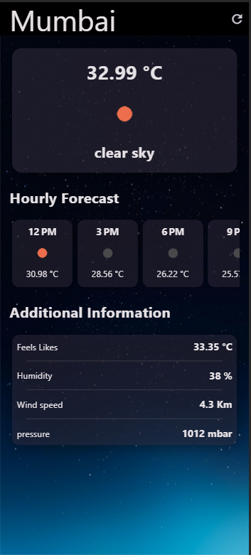
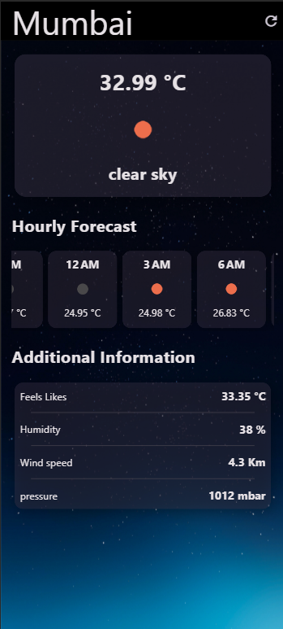

# Weather App

*-
## Features

- **Current Weather:** Displays the current temperature, weather description, and an icon representing the current weather condition.
- **Hourly Forecast:** Shows the hourly forecast for the next 15 hours, including temperature and weather icons.
- **Additional Information:** Provides additional details such as "Feels Like" temperature, humidity, wind speed, and atmospheric pressure.

## Setup

1. **Clone the repository:**

   ```bash
   git clone https://github.com/your_username/weather_app.git

2. **Navigate to the project directory:**

   ```bash
   cd weather_app

3. **Install dependencies:**
   ````bash
   flutter pub get

4. **Create a file named 'screte.dart' in the project root with your OpenWeatherMap API key:**

   ```dart
   const String APIkey = 'your_openweathermap_api_key';

3. **Run the app:**
   ````bash
   flutter Run

## Dependencies

- http: For making HTTP requests to the OpenWeatherMap API.
- intl: For formatting date and time.
- flutter/material.dart: For building the user interface.


## Usage

1. Launch the app.
2. The default city is set to 'Mumbai', but you can customize it in the **'getCurrentData'** method of the **'WeatherScreen'** class.
3. The app will display the current weather information, hourly forecast, and additional details.


## Screenshots



